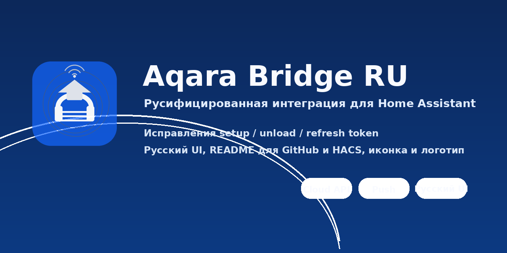

# Aqara Bridge RU для Home Assistant

Русифицированная и доработанная версия пользовательской интеграции **Aqara Bridge** для **Home Assistant**.

Интеграция подключает устройства Aqara через **Aqara IoT Cloud** и использует облачное API + push-события через RocketMQ. Подходит для тех случаев, когда устройство уже живёт в Aqara Home, а добавить его напрямую в Home Assistant штатным способом не получается.



## Что сделано в этой версии

- исправлены критичные ошибки инициализации и обновления токена;
- исправлена загрузка и выгрузка платформ через актуальный API Home Assistant;
- добавлен русский перевод мастера настройки и окна параметров;
- приведены описания репозитория к виду, пригодному для GitHub и HACS;
- добавлены иконка и логотип репозитория;
- убран служебный мусор из архива.

## Возможности

- подключение аккаунта Aqara Home;
- импорт поддерживаемых устройств из Aqara Cloud;
- получение состояний и событий устройств;
- работа через config flow из интерфейса Home Assistant;
- обновление токенов и параметров через меню интеграции.

## Что важно знать заранее

Эта интеграция **не является официальной**. Для работы нужен доступ к **Aqara Developer Platform** и параметры приложения:

- `App ID`
- `App Key`
- `Key ID`
- при необходимости `Refresh Token`

Также используется пакет `rocketmq`. На некоторых системах и архитектурах могут понадобиться дополнительные проверки совместимости.

## Установка через HACS

1. Откройте **HACS** → **Интеграции**.
2. Добавьте пользовательский репозиторий этого проекта.
3. Выберите тип **Integration**.
4. Установите **Aqara Bridge RU**.
5. Перезапустите Home Assistant.
6. Перейдите в **Настройки** → **Устройства и службы** → **Добавить интеграцию**.
7. Найдите **Aqara Bridge** и заполните поля.

## Установка вручную

1. Скопируйте папку `custom_components/aqara_bridge` в каталог:

   ```
   /config/custom_components/aqara_bridge
   ```

2. Перезапустите Home Assistant.
3. Добавьте интеграцию через интерфейс.

## Настройка

Во время первичной настройки будут запрошены:

- страна/регион облачного сервера;
- аккаунт Aqara Home;
- App ID;
- App Key;
- Key ID;
- код подтверждения из SMS или email.

После успешной авторизации интеграция предложит выбрать устройства для добавления.

## Поддерживаемые платформы

В составе интеграции присутствуют платформы:

- `binary_sensor`
- `climate`
- `cover`
- `event`
- `light`
- `remote`
- `sensor`
- `switch`
- `air_quality`

Фактический набор сущностей зависит от модели устройства и от того, как она описана во внутреннем mapping.

## Типичные проблемы

### Интеграция не добавляется через UI

Частая причина — проблемы с библиотекой `rocketmq` или несовместимость архитектуры/окружения.

### Устройства не появляются

Проверьте:

- корректность `App ID / App Key / Key ID`;
- что нужный регион выбран правильно;
- что приложение в Aqara Developer Platform настроено на push-события;
- что у аккаунта есть доступ к устройствам в Aqara Home.

### Токен перестал работать

Откройте параметры интеграции и выполните повторную авторизацию или обновите `Refresh Token`.

## Структура репозитория

```text
custom_components/aqara_bridge/   Основной код интеграции
assets/                           Иконка и логотип
README.md                         Описание проекта
CHANGELOG.md                      История изменений
LICENSE                           Лицензия исходного проекта
```

## Изменения в этой сборке

Смотрите файл [CHANGELOG.md](CHANGELOG.md).

## Благодарности

Основа проекта — оригинальная интеграция Aqara Bridge и её авторы/контрибьюторы.

Эта сборка адаптирована, исправлена и русифицирована для более удобного использования в Home Assistant.
